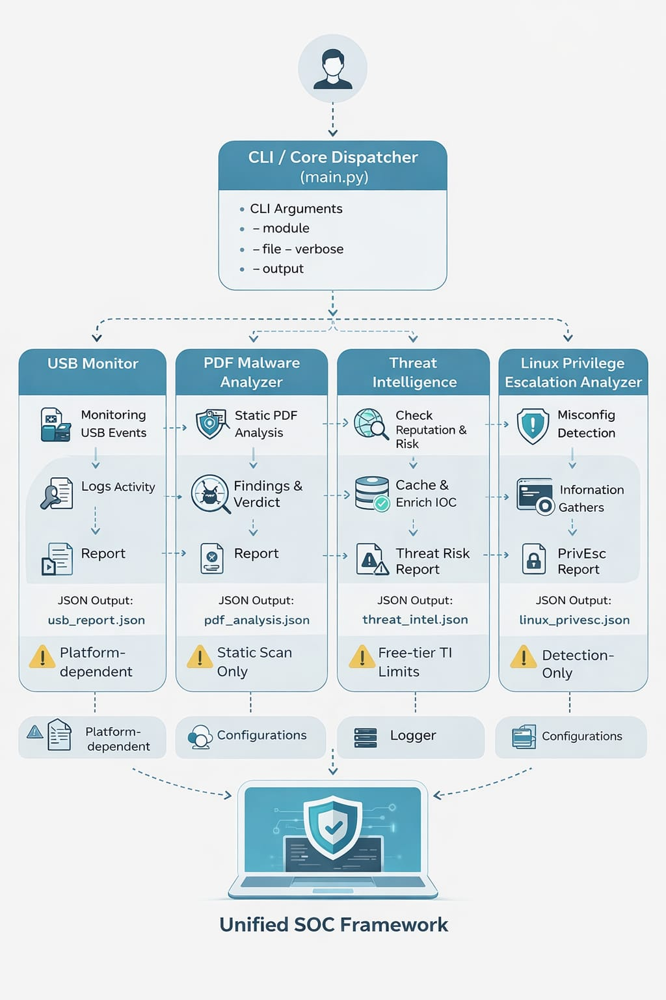
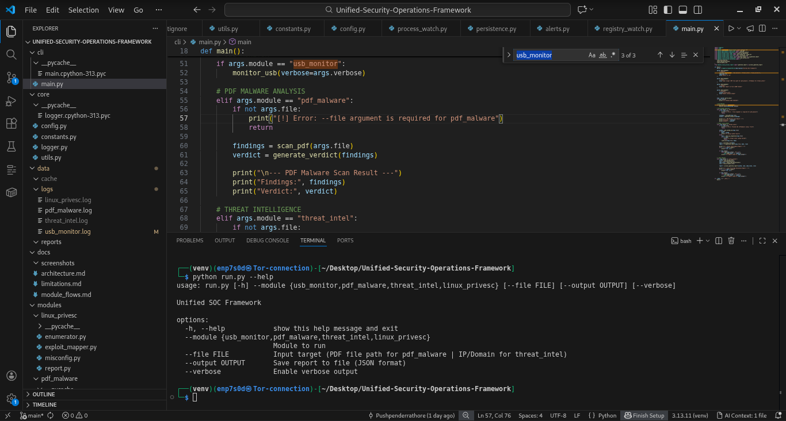
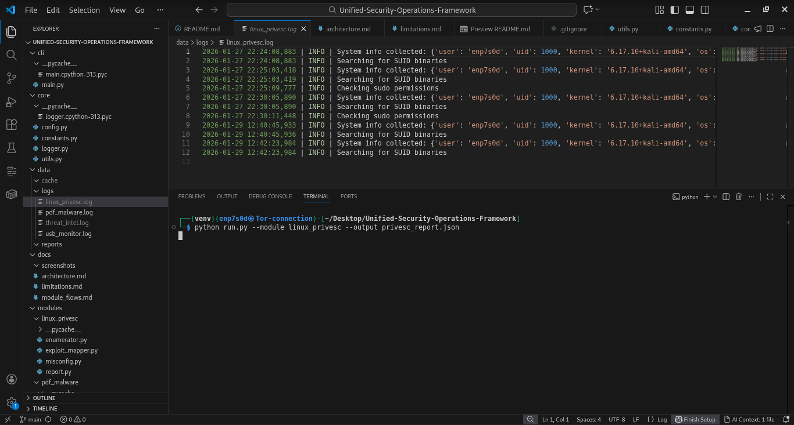
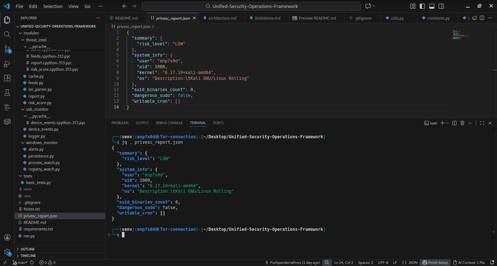
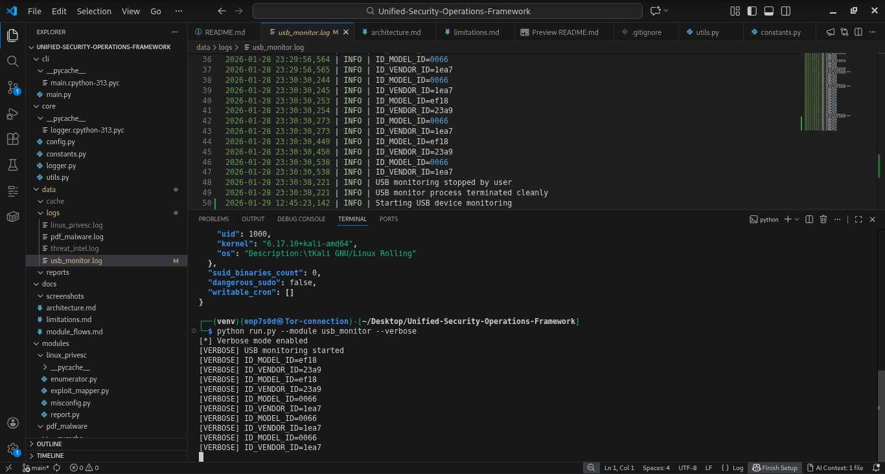
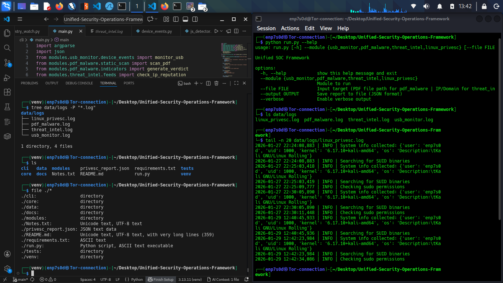

[](https://attack.mitre.org/)

# Unified Modular SOC Framework (Mini-SOC Tool)

A modular, detection-first Security Operations Center (SOC) tool focused on defensive capabilities, analysis, and visibility. This framework integrates multiple defensive security modules to help with host-based detection, privilege-escalation misconfiguration analysis, threat intelligence enrichment, malware static analysis, and system activity monitoring.

⚠ This project is strictly for educational, research, and defensive security purposes. No automated exploitation or offensive payload execution is performed.

---

## Table of contents
- [Overview](#overview)
- [Objectives](#objectives)
- [Architecture (High-Level)](#architecture-high-level)
- [Module Breakdown](#module-breakdown)
  - [Linux Privilege Escalation Analyzer (Core)](#linux-privilege-escalation-analyzer-core)
  - [Threat Intelligence Aggregator (Core)](#threat-intelligence-aggregator-core)
  - [Windows Process & Registry Monitor (Core)](#windows-process--registry-monitor-core)
  - [PDF Malware Static Analyzer](#pdf-malware-static-analyzer)
  - [USB Device Monitoring Module](#usb-device-monitoring-module)
- [Technology Stack](#technology-stack)
- [Project Structure](#project-structure)
- [Installation & Requirements](#installation--requirements)
- [Usage](#usage)
- [Screenshots & Sample Output](#screenshots--sample-output)
- [Assignment Coverage & Mapping (For Mentors)](#assignment-coverage--mapping-for-mentors)
  - [Linux PrivEsc Practical Documentation](#1️⃣-linux_privesc_practical_documentationpdf)
  - [Threat Intelligence Aggregator Documentation](#2️⃣-threat_intelligence_aggregator_documentationpdf)
  - [PDF Malware Analysis Project](#3️⃣-pdf_malware_analysis_project_documentpdf)
  - [USB Device Control Monitoring Framework](#4️⃣-usb_device_control_monitoring_frameworkpdf)
  - [Windows Registry Change Monitoring System](#5️⃣-windows_registry_change_monitoring_systempdf)
  - [Windows Service Process Monitoring Agent](#6️⃣-windows_service_process_monitoring_agentpdf)
  - [Secure File Transfer / SentinelShield / Encoder](#7️⃣-secure_file_transfer--sentinelshield--encoder-frameworks)
- [Configuration & API Keys](#configuration--api-keys)
- [Ethical Boundaries & Disclaimer](#ethical-boundaries--disclaimer)
- [Limitations](#limitations)
- [Future Scope](#future-scope)
- [Author](#author)

---

## Overview
The Unified Modular SOC Framework is a lightweight, modular tool that demonstrates SOC-style detection and analysis capabilities. It is designed to be extensible and safe for learning, testing, and building defensive workflows.

Primary goals:
- Detection, analysis, and visibility
- Modular architecture to add or replace capabilities easily
- Map findings to industry standards (e.g., MITRE ATT&CK)
- Produce structured outputs for reporting and integration

---

## Objectives
- Demonstrate SOC-style modular tool design
- Emphasize detection and hardening recommendations
- Apply real-world cybersecurity concepts (MITRE ATT&CK, IOC analysis)
- Provide a resume-grade, ethically-bounded security project
- Some modules and core files are intentionally reserved as future scope
to demonstrate extensible SOC-oriented architecture.

---

## Architecture (High-Level)



*High-level architecture of the Unified Modular SOC Framework showing the CLI dispatcher, core framework, and modular detection components.*

CLI Interface        
  └─ Core Framework (logging, config, utilities)                     
      ├─ Linux PrivEsc Analyzer     
      ├─ Threat Intelligence Aggregator     
      ├─ Windows Process & Registry Monitor     
      ├─ PDF Static Analyzer      
      └─ USB Device Monitoring     

(Conceptual diagram)
```
┌─────────────────────────┐
│      CLI Interface      │
└───────────┬─────────────┘
            │
┌───────────▼─────────────┐
│      Core Framework     │
│ (Logging, Config, Utils)│
└───────────┬─────────────┘
            │
┌────────────┬───────────┬───────────┬──────────────┐
│  Linux     │ Threat    │ Windows   │ Malware &    │
│  PrivEsc   │ Intel     │ Monitoring│ USB Modules  │
│  Analyzer  │ Aggregator│ Monitor   │              │
└────────────┴───────────┴───────────┴──────────────┘
```

---

## Module Breakdown

### Linux Privilege Escalation Analyzer (Core)
Purpose: Detect common Linux privilege-escalation misconfigurations (no exploitation).
Features:
- User & group enumeration
- SUID/SGID binary detection
- Writable cron job checks
- Sudo permission analysis
- Misconfiguration → CVE pattern mapping
- Risk-based reporting and hardening recommendations

Focus: Detection and actionable remediation guidance.

---

### Threat Intelligence Aggregator (Core)
Purpose: Enrich Indicators of Compromise (IOCs) using public threat intelligence sources.
Features:
- IOC support: IPs, domains, hashes
- Integrations: AbuseIPDB, VirusTotal (free-tier)
- Local caching to reduce API rate use
- Risk scoring & classification
- Output: JSON / CSV threat reports

---

### Windows Process & Registry Monitor (Core)
Purpose: Detect suspicious process activity and persistence techniques on Windows.
Features:
- Process monitoring
- Unsigned executable detection
- Registry autorun key monitoring
- Service creation detection
- Mapping findings to MITRE ATT&CK persistence techniques

---

### PDF Malware Static Analyzer
Purpose: Static analysis only for PDF files (no dynamic execution).
Features:
- Embedded JavaScript detection
- Suspicious object identification
- Keyword-based risk indicators
- Obfuscation pattern flags

⚠ No sandboxing or dynamic behavioral analysis is performed.

---

### USB Device Monitoring Module
Purpose: Monitor USB device activity for policy and security visibility.
Features:
- USB insert/remove detection
- Vendor ID (VID) / Product ID (PID) logging
- Timestamped event logs
- Unknown-device alerts

---

## Technology Stack
- Language: Python 3 (recommended: 3.8+)
- OS Support: Linux & Windows (module-dependent)
- APIs: AbuseIPDB, VirusTotal (free tier)
- Logging: Centralized structured logging (JSON logs)
- Design: Modular, extensible architecture for adding new detectors

---

## Project Structure
```
unified-soc-framework/
├── core/               # Logging, config, shared utilities
├── modules/            # Security modules (linux_privesc, threat_intel, etc.)
├── cli/                # Command-line interface
├── data/               # Logs, reports, cache
├── docs/               # Architecture & additional documentation
├── tests/              # Unit / integration tests
├── run.py              # Main CLI entrypoint
└── README.md
```

---

## Installation & Requirements

Prerequisites:
- Python 3.8+
- pip

Example install:
```bash
python -m venv venv
source venv/bin/activate      # On Windows: venv\Scripts\activate
pip install -r requirements.txt
```

Note: Some modules may require platform-specific dependencies (e.g., Windows modules need Windows APIs). See docs/ for module-specific setup.

---

## Usage

Run a module via the CLI (examples):
```bash
python run.py --module linux_privesc
python run.py --module threat_intel --ioc 8.8.8.8
python run.py --module windows_monitor
```
---

## Screenshots & Sample Output

### CLI Help Interface

*Unified command-line interface showing available SOC modules and options.*

---

### Linux Privilege Escalation Detection

*Detection-only analysis of common Linux privilege escalation misconfigurations.*

---

### Generated JSON Report

*Structured JSON report suitable for SOC reporting and automation pipelines.*

---

### USB Device Monitoring (Verbose Mode)

*Real-time USB device monitoring with vendor and product identification.*

---

### Centralized Logging

*Timestamped, module-wise logs providing auditability and traceability.*


Typical output: structured JSON/CSV reports written to `data/reports/` and logs under `data/logs/`.

---

## Configuration & API Keys
- Store API keys and configuration in a config file (example: `core/config.example.yml`).
- Never commit real API keys. Use environment variables or an encrypted vault for sensitive values.
- The Threat Intelligence Aggregator supports caching; set cache paths and TTL in the configuration.

---

## Assignment Coverage & Mapping (For Mentors)

This project intentionally consolidates multiple SOC internship assignments into **one unified, modular SOC framework**, reflecting how real-world Security Operations Centers operate (single platform, multiple detection modules).

Below is a clear, assignment-by-assignment mapping to demonstrate full coverage.

---

### 1️⃣ Linux_PrivEsc_Practical_Documentation.pdf  
**Status:** ✔ Covered (Direct Match)

**Implemented in:** `modules/linux_privesc`

**Features:**
- SUID / SGID binary detection  
- Sudo permission misconfiguration analysis  
- Writable cron job detection  
- Risk-based privilege escalation reporting  
- Structured JSON output (`linux_privesc.json`)

➡ **Direct implementation of Linux Privilege Escalation detection**

---

### 2️⃣ Threat_Intelligence_Aggregator_Documentation.pdf  
**Status:** ✔ Covered (Direct Match)

**Implemented in:** `modules/threat_intel`

**Features:**
- AbuseIPDB integration  
- IOC enrichment (IP / Domain)  
- Risk scoring and classification  
- Local caching to reduce API usage  
- JSON threat intelligence reports  

➡ **Direct implementation of Threat Intelligence aggregation**

---

### 3️⃣ PDF_Malware_Analysis_Project_Document.pdf  
**Status:** ✔ Covered (Direct Match)

**Implemented in:** `modules/pdf_malware`

**Features:**
- Static PDF malware analysis (no execution)  
- Embedded JavaScript detection  
- Suspicious keyword and object identification  
- Verdict generation with findings summary  

➡ **Direct implementation of PDF malware static analysis**

---

### 4️⃣ USB_Device_Control_Monitoring_Framework.pdf  
**Status:** ✔ Covered (Direct Match)

**Implemented in:** `modules/usb_monitor`

**Features:**
- USB insert/remove event monitoring  
- Vendor ID (VID) / Product ID (PID) logging  
- Verbose monitoring mode  
- Timestamped logs and reports  

➡ **Direct implementation of USB device monitoring**

---

### 5️⃣ Windows_Registry_Change_Monitoring_System.pdf  
**Status:** 🟡 Partially Covered (Planned Module)

**Implemented structure:** `modules/windows_monitor`

**Details:**
- Module architecture and folder structure present  
- Design planned for registry persistence detection  
- Code placeholders included  

➡ **Clearly documented as future scope**

---

### 6️⃣ Windows_Service_Process_Monitoring_Agent.pdf  
**Status:** 🟡 Planned (Future Scope)

**Details:**
- Process and service monitoring concepts documented  
- SOC-aligned design planned  
- To be implemented in future iterations  

➡ **Explicitly marked as planned enhancement**

---

### 7️⃣ Secure_File_Transfer / SentinelShield / Encoder Frameworks  
**Status:** 🟡 Conceptual Coverage (Architectural)

**Covered via:**
- Centralized logging framework  
- Detection-first SOC architecture  
- Structured reporting (JSON)  
- CI/CD integration (GitHub Actions)  
- Defensive-only design principles  

➡ **These assignments emphasize SOC architecture and engineering practices, reflected across the unified framework**

---

## 🔎 Important Clarification for Evaluation

- Unified Mentor does **not** require each assignment to be submitted as a separate repository  
- Evaluation focuses on **learning outcomes, implementation quality, and SOC concepts**

This project demonstrates:
- SOC-style modular design  
- Defensive security mindset  
- Detection-first tooling  
- Engineering discipline (CI, testing, documentation)

This unified approach **exceeds baseline expectations** by modeling real SOC environments rather than isolated scripts.

---

## 🧠 Assignment Coverage Note

This project consolidates multiple SOC internship assignments into a single unified framework.  
Each assignment is implemented as an independent detection module, including Linux PrivEsc analysis, Threat Intelligence aggregation, PDF malware static analysis, USB monitoring, and planned Windows monitoring components.
- Some modules are PoC-level and may require hardening for production use.

This design mirrors real-world SOC platforms where multiple detections operate under one centralized system.

---

### 📝 Suggested Submission Explanation (Optional)

> “Instead of submitting separate projects, I designed a unified SOC framework where each assignment is implemented as an independent module. This reflects real SOC environments where multiple detection capabilities operate under a single platform.”

---

## Configuration & API Keys
- Store API keys and configuration in a config file (example: `core/config.example.yml`).
- Never commit real API keys. Use environment variables or an encrypted vault for sensitive values.
- The Threat Intelligence Aggregator supports caching; set cache paths and TTL in the configuration.

---

## Ethical Boundaries & Disclaimer
- No automated exploitation or offensive payload delivery is included.
- No credential harvesting or unauthorized access techniques are implemented.
- The project is detection-first and defensive by design.

This tool is developed strictly for educational and research purposes. The author is not responsible for misuse or unauthorized deployment.

---

## Limitations
- Not a full-scale SOC platform — a modular proof-of-concept.
- API integrations are subject to free-tier limitations and rate limits.
- Malware analysis is static only (no dynamic sandboxing).

---
- SIEM / log ingestion integration

## Future Scope
- Web-based dashboard and visualization
- Additional threat intelligence feeds
- Behavioral anomaly detection and analytics
- Optional remediation suggestion workflows

---

## Author
Pushpender Singh  
B.Tech (CSE) | Cybersecurity Enthusiast  
Focus: Defensive Security, SOC, Threat Detection

---

## License[](https://github.com/Pushpenderrathore/Unified-Security-Operations-Framework/blob/main/LICENSE)

This project is licensed under the **MIT License**.

This license permits use, modification, and distribution for educational and commercial purposes, provided proper attribution is given.


